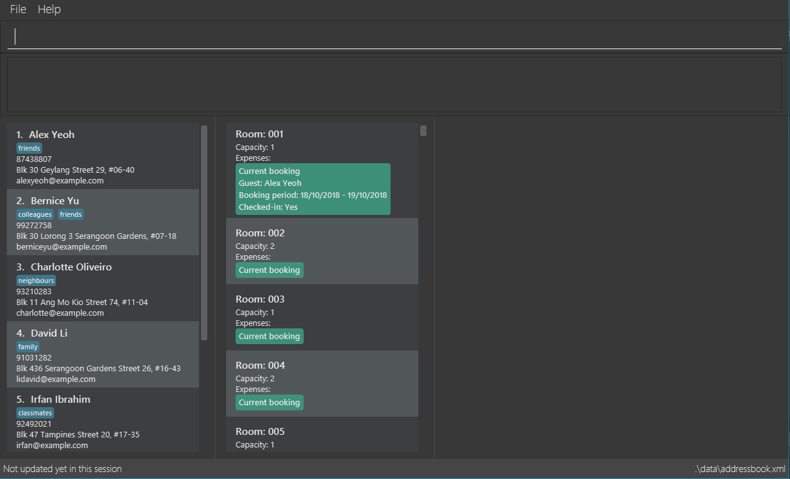

= Concierge v1.2
ifdef::env-github,env-browser[:relfileprefix: docs/]

https://travis-ci.org/CS2103-AY1819S1-F11-2/main[image:https://travis-ci.org/CS2103-AY1819S1-F11-2/main.svg?branch=master[Build Status]]
https://ci.appveyor.com/project/CS2103-AY1819S1-F11-2/main[image:https://ci.appveyor.com/api/projects/status/3boko2x2vr5cc3w2?svg=true[Build status]]
https://coveralls.io/github/CS2103-AY1819S1-F11-2/main?branch=master[image:https://coveralls.io/repos/github/CS2103-AY1819S1-F11-2/main/badge.svg?branch=master[Coverage Status]]
https://gitter.im/se-edu/Lobby[image:https://badges.gitter.im/se-edu/Lobby.svg[Gitter chat]]

ifdef::env-github[]

endif::[]

* Concierge is a desktop Hotel Management application. It has a GUI but most of the user interactions happen using a CLI (Command Line Interface).
* It is a concise Java application intended for small hotels looking for a simple application to manage basic hotel features.
* Value Proposition
** A simple, intuitive and free command line tool for managing a small-scale hotel.
** Hassle-free for receptionists in managing day-to-day hotel operations.
** A logistics tool that generates insightful reports for hotel managers to assess hotel efficiency

== Site Map

* <<UserGuide#, User Guide>>
* <<DeveloperGuide#, Developer Guide>>
* <<AboutUs#, About Us>>
* <<ContactUs#, Contact Us>>

== Acknowledgements

* Some parts of this sample application were inspired by the excellent http://code.makery.ch/library/javafx-8-tutorial/[Java FX tutorial] by
_Marco Jakob_.
* Libraries used: https://github.com/TestFX/TestFX[TextFX], https://bitbucket.org/controlsfx/controlsfx/[ControlsFX], https://github.com/FasterXML/jackson[Jackson], https://github.com/google/guava[Guava], https://github.com/junit-team/junit5[JUnit5]
* The original source of the code is AddressBook - level 4 : https://github.com/se-edu/

== Licence : link:LICENSE[MIT]
